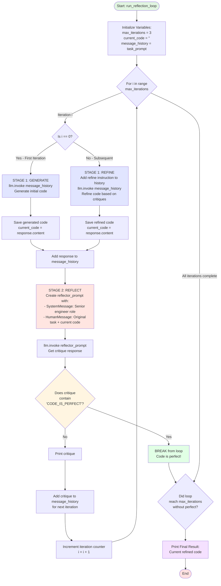
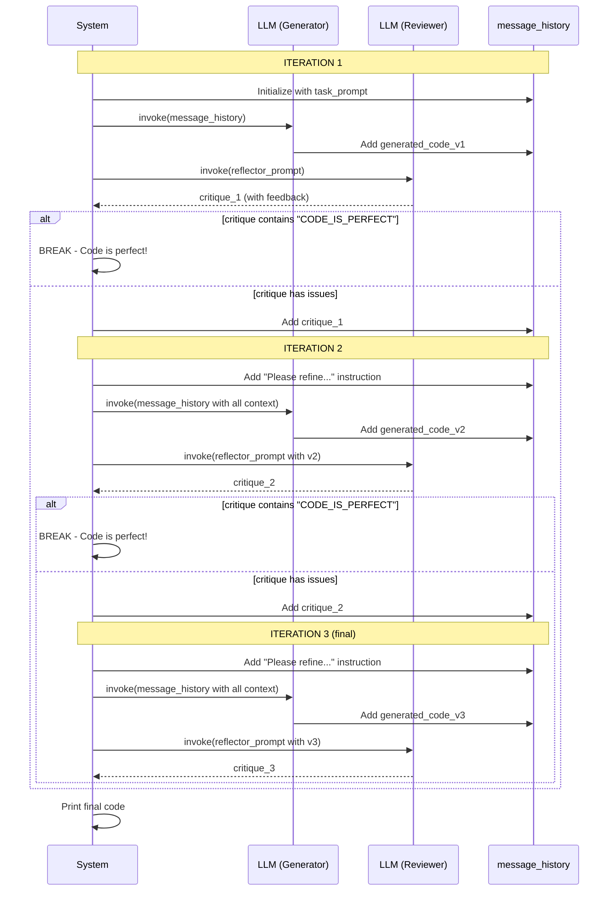
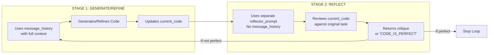

# Reflection Loop Flow Diagram

This diagram visualizes how the reflection loop in `04_refection.py` works.

## Main Flow Diagram

## Message History Flow (Sequence Diagram)

## Stage Comparison

## Key Points

1. **Stopping Condition**: The loop stops when the critique contains the exact phrase `"CODE_IS_PERFECT"` (line 77 in code)
2. **Message History**: Builds up across iterations to provide full context to the generator
3. **Two-Stage Process**: 
   - Stage 1 uses accumulated history (context-aware)
   - Stage 2 uses fresh prompt (objective review)
4. **Maximum Iterations**: Will stop after 3 iterations even if not perfect

